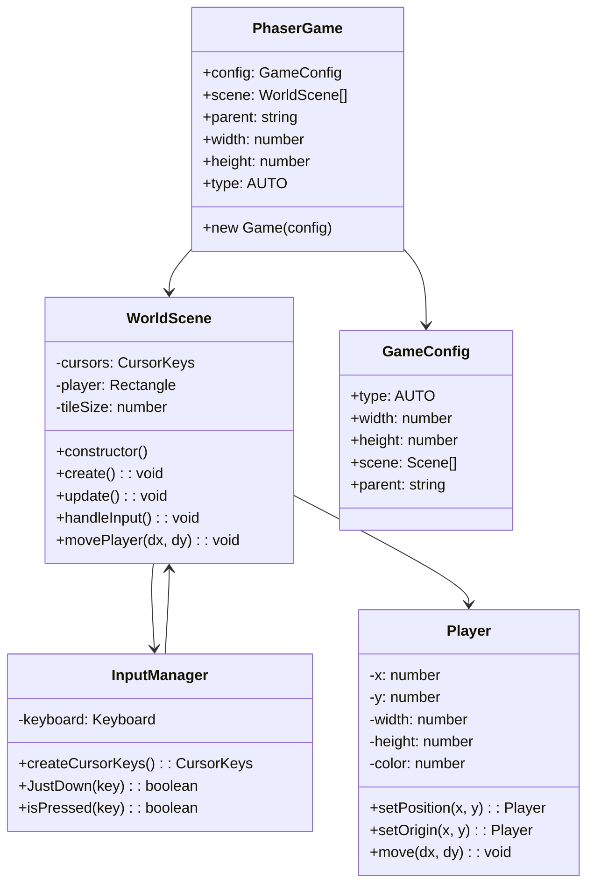
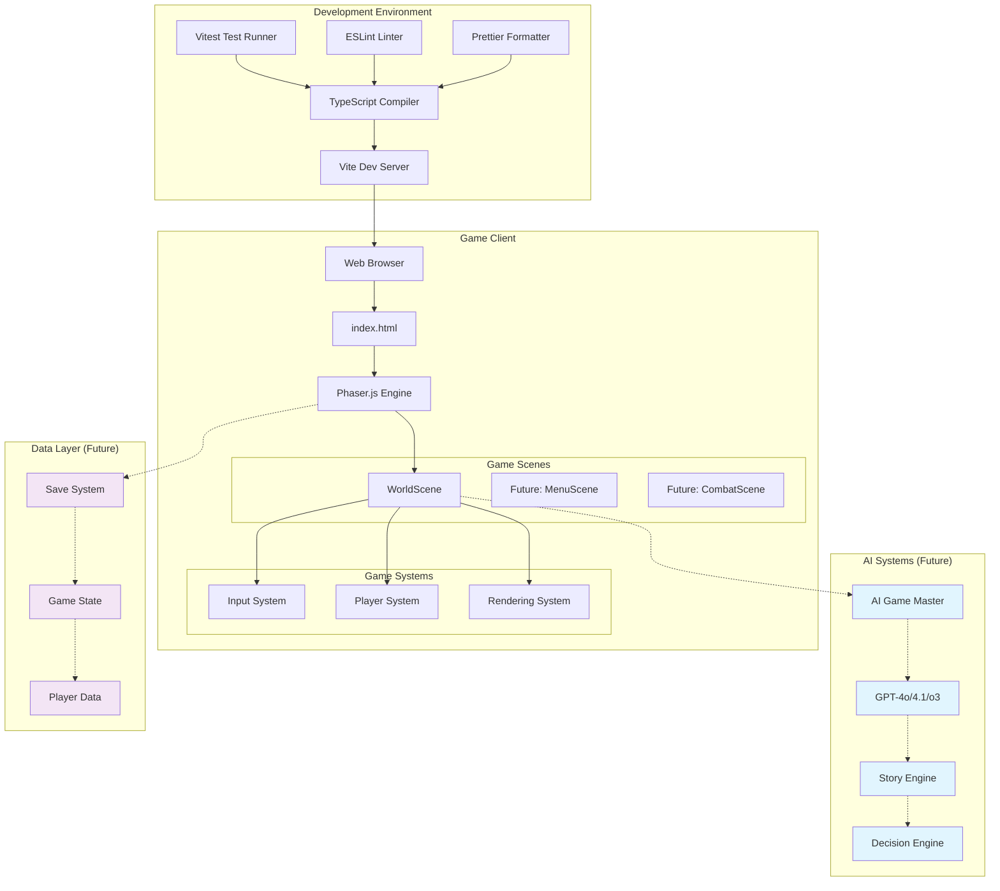
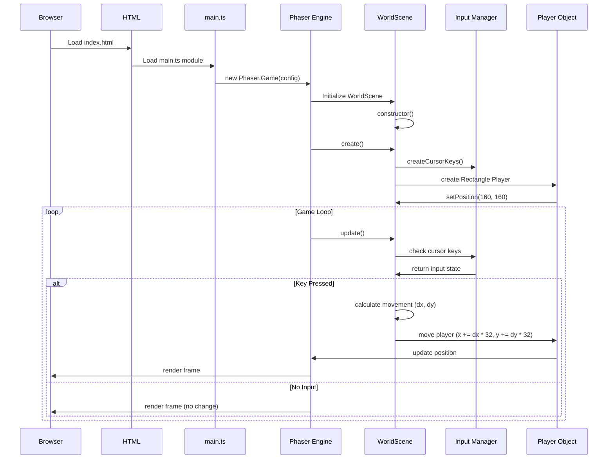

# Syntheos Saga - システムアーキテクチャー概要

> Generated by Code Cartographer on 2025年7月6日 22:01:02

## 🎯 プロジェクト概要

**Syntheos Saga** は、AI-GM（AI Game Master）を搭載した2D タイルベースRPGゲームです。GPT-4o/4.1/o3を活用したAI GMシステムにより、動的なストーリーテリングとゲーム体験を提供します。

## 🏗️ システム構成

### レベル1: 詳細コンポーネント図



### レベル2: データフロー図

```mermaid
flowchart TD
    Start([ゲーム開始]) --> HTML[index.html]
    HTML --> MainTS[main.ts]
    MainTS --> Config[Phaser Game Config]
    Config --> Engine[Phaser Engine]
    Engine --> Scene[WorldScene]
    
    Scene --> Create[create\(\)]
    Create --> Input[Input Manager]
    Create --> PlayerObj[Player Object]
    
    Scene --> Update[update\(\)]
    Update --> KeyCheck{キー入力確認}
    KeyCheck -->|入力あり| Move[プレイヤー移動]
    KeyCheck -->|入力なし| Update
    Move --> Render[レンダリング]
    Render --> Update
    
    subgraph "Input System"
        Input --> Cursor[Cursor Keys]
        Cursor --> Arrow[Arrow Keys]
        Arrow --> JustDown[JustDown Check]
    end
    
    subgraph "Player System"
        PlayerObj --> Position[Position\(x, y\)]
        Position --> TileGrid[Tile Grid 32x32]
        TileGrid --> Movement[Movement Logic]
    end
    
    subgraph "Rendering System"
        Render --> WebGL[WebGL/Canvas]
        WebGL --> Display[Display Update]
    end
```

### レベル3: システムアーキテクチャー図



### レベル4: 現在の処理シーケンス図



## 🔧 主要コンポーネント詳細

### MainEntry (main.ts)
**責務：**
- ゲームエンジンの初期化
- 設定管理
- シーンの登録

**構成：**
```typescript
const config: Phaser.Types.Core.GameConfig = {
  type: Phaser.AUTO,
  width: 640,
  height: 480,
  scene: [WorldScene],
  parent: 'game'
}
```

### WorldScene
**責務：**
- ゲーム世界の管理
- プレイヤー制御
- 入力処理
- レンダリング管理

**主要メソッド：**
- `create()`: シーンの初期化
- `update()`: ゲームループ
- プレイヤー移動ロジック（タイルベース）

### Player System
**責務：**
- プレイヤーの状態管理
- 移動処理
- 衝突判定（将来実装）

**特徴：**
- 32x32ピクセルタイルベース
- 段階的移動（JustDown検知）
- 赤色矩形での表示

## 🔄 ゲームフロー

### 現在の実装フロー
1. **初期化フェーズ**
   - HTMLロード → main.ts実行
   - Phaser Gameオブジェクト生成
   - WorldSceneの初期化

2. **ゲームループ**
   - 入力チェック（矢印キー）
   - プレイヤー移動計算
   - レンダリング更新

3. **入力処理**
   - JustDown による段階的移動
   - タイルサイズ（32px）単位での移動

### 将来の拡張フロー
1. **AI-GM統合**
   - GPT-4o/4.1/o3との連携
   - 動的ストーリー生成
   - 状況に応じたゲーム展開

2. **マルチシーン対応**
   - メニューシーン
   - 戦闘シーン
   - インベントリシーン

## 🛠️ 技術スタック

### Core Technologies
- **言語**: TypeScript 5.8.3
- **ゲームエンジン**: Phaser.js 3.70.0
- **モジュールシステム**: ESModules

### Development Tools
- **ビルドツール**: Vite 7.0.2
- **テスティング**: Vitest 1.0.0 + jsdom
- **リンター**: ESLint 9.0.0
- **フォーマッター**: Prettier 3.0.0

### AI Integration (Future)
- **AI Models**: GPT-4o, GPT-4.1, o3
- **Development**: Codex integration
- **Usage Management**: Cost optimization

## 📊 現在の実装状況

### ✅ 実装済み
- [x] 基本的なゲームループ
- [x] プレイヤー移動システム
- [x] タイルベース移動
- [x] 入力処理（矢印キー）
- [x] レンダリングシステム

### 🔄 開発中
- [ ] AI-GM システム
- [ ] マルチシーン対応
- [ ] セーブ・ロード機能
- [ ] マップタイル系統
- [ ] 戦闘システム

### 🎯 将来計画
- [ ] GPT連携によるストーリー生成
- [ ] 動的NPC生成
- [ ] インベントリシステム
- [ ] マルチプレイヤー対応

## 🔍 Mermaidプレビュー方法

1. **VS Code/Cursor**: Mermaid拡張機能をインストール
2. **プレビュー**: `Cmd/Ctrl + Shift + V` でMarkdownプレビュー
3. **オンライン**: [Mermaid Live Editor](https://mermaid.live) で図を表示

## 📚 関連ドキュメント

- [開発ガイド](./README.md)
- [AI開発環境](./AGENTS.md)
- [テスト仕様](./src/map/WorldScene.test.ts)

## 🎮 開発コマンド

```bash
# 開発サーバー起動
npm run dev

# ビルド実行
npm run build

# テスト実行
npm run test

# コード品質チェック
npm run lint
npm run format
```

---

## 🤖 AI開発環境について

このプロジェクトは**AI エージェント**によって開発されています：

### モデル使用方針
- **GPT-4o**: デフォルト会話・小修正
- **GPT-4.1**: 中規模コード生成
- **o3**: 大規模リファクタリング

### 開発ワークフロー
- **Codex**: ブラウザ・CLI統合開発
- **自動生成**: コード・テスト・ドキュメント
- **コスト管理**: 使用量モニタリング

---

*このドキュメントは Code Cartographer により自動生成されました。*  
*定期的な更新を推奨します。*

## 🔄 更新履歴

- **2025-07-06**: 初回アーキテクチャー図生成
- **2025-07-06**: コンポーネント詳細分析完了
- **2025-07-06**: AI統合計画追加 